# Inevitable First Order Phase Transitions in 3D Quantum Hall Systems

Kaiyuan Gu,1 Kai Torrens,2 and Biao Lian1

1Department of Physics, Princeton University, Princeton, New Jersey 08544, USA  
2Department of Physics, Harvard University, Cambridge, Massachusetts 02138, USA  
(Dated: March 29, 2026)

Recent experiments suggest that low carrier density three-dimensional (3D) metals ZrTe5 and $\mathrm { H f T e _ { 5 } }$ exhibit the 3D quantum Hall (QH) effect with Hall resistivity plateaus and a metal-insulator transition in strong magnetic fields. The conventional 3D QH theory requires a fixed period charge density wave (CDW), which is however not observed experimentally. We investigate alternative non-CDW mechanisms by considering a 3D metal in strong magnetic fields with electrons coupled to a boson (e.g., phonon) field. We show that as the number of partially occupied Landau level bands jumps, the model exhibits inevitable first order phase transitions driven by a Stoner instability due to diverging density of states, which do not involve CDW. These transitions may drive the system into a phase separation state with percolation transitions. We further show this can lead to Hall resistivity quasi-plateaus similar to that observed experimentally, and can provide a natural explanation for the metal-insulator transition.

The celebrated integer quantum Hall (QH) effect of two-dimensional (2D) electron gas exhibits a quantized Hall conductance plateaus in units of $e ^ { 2 } / h$ [1] in terms of electron charge e and Planck constant $h = 2 \pi \hbar$ , with coefficient given by the topological Chern number which equals the number of occupied Landau levels (LLs) [2, 3]. Its generalization to the 3D QH effect in 3D metals, which is topologically equivalent to infinite layers of 2D QH effects, is however extremely difficult due to the gapless bands of 3D electrons in magnetic field. A gap opening is needed for the 3D QH effect, which was first proposed to come from a fixed spatial period charge density wave (CDW) along the magnetic field [4–7]. Similarly, the 3D quantum anomalous Hall effect without magnetic field relies on the underlying 3D periodic lattice [8–12], and the 3D QH effect in Weyl semimetal relies on fixed momentum differences between Weyl points [13, 14].

Recently, quasi-quantized plateaus of Hall resistivity were observed in low carrier density anisotropic metals $\mathrm { Z r T e _ { 5 } }$ and $\mathrm { H f T e _ { 5 } }$ [15–23], as well as in $\mathrm { M n } ( \mathrm { B i } _ { x } \mathrm { S b } _ { 1 - x } ) _ { 4 } \mathrm { T e } _ { 7 }$ later [24], suggesting the potential realization of the 3D QH effect. A magnetic field independent CDW induced 3D QH effect has been proposed as a theoretical mechanism [17, 18, 25, 26], in which the longitudinal resistivity approaches zero. However, the CDW mechanism is unsupported by other experiments showing quasi-quantized Hall resistivity but finite longitudinal resistivity [18–20], and transport and spectroscopy measurements found no evidence of CDW [20, 21, 23]. Even if the conventional Fermi surface Peierls instability CDW is present, its period is magnetic field dependent and cannot explain the 3D QH effect.

In this letter, we investigate the instabilities other than CDW in such 3D anisotropic metals in magnetic field. We show that when electrons interact with some boson (most probably phonon) field, without assuming CDW, a first order phase transition (of uniform strain if the bosons are acoustic phonons) is inevitable when the Fermi level is near a Landau level (LL) band bottom, due to the diverging density of states therein which generically leads to a Stoner instability. Increasing the disorders could weaken and eventually eliminate the first order transitions. Such first order phase transitions may drive the system into a phase separation state exhibiting percolation transitions, which make the Hall resistivity deviate from the linear magnetic field dependence and exhibit quasi Hall plateaus similar to the experimental observations. Our percolation theory further provides a natural explanation for the metal-insulator transition observed at large magnetic field [17].

The model. While our model is aimed to describe generic anisotropic low electron density metals, we focus on the class of materials where the 3D QH effect was first observed, $\mathrm { Z r T e _ { 5 } }$ and $\mathrm { H f T e _ { 5 } } .$ , which contain both massive Dirac electrons at Γ point and quadratic dispersion electrons near the Brillouin zone boundary [18, 21, 27, 28]. For universality, we construct our model as dimensionless via a rescaling (see below Eq. (2)), which has a dimensionless magnetic field B in the z direction. This yields LLs in the x-y plane, and the n-th LL $( n \geq 0 , n \in \mathbb { Z } )$ has a 1D dispersion with respect to the dimensionless momentum kz (Fig. 1(c)):

$$
\epsilon_ {n, k _ {z}} (B) = \left\{ \begin{array}{l} \frac {1}{2} k _ {z} ^ {2} + B \left(n + \frac {1}{2}\right), \quad (\text { quadratic }) \\ M \sqrt {M ^ {2} + 2 B n + k _ {z} ^ {2}} - M ^ {2}, (\text { Dirac }) \end{array} \right. \tag {1}
$$

where M is the dimensionless Dirac mass gap. For simplicity, we assume only one type of electrons (quadratic or Dirac) with negligible spin Zeeman splitting, so that spin only contributes a factor of 2 of degeneracy to electron numbers (except for the Dirac $n = 0$ mode which has no spin degeneracy). Taking these simplifications or not does not qualitatively alter our theory.

Focusing on the quasi-1D physics, we assume the quasi-1D LL bands in Eq. (1) have a dimensionless Hamiltonian per volume $H = H _ { \mathrm { e } } + H _ { \mathrm { i n t } } + H _ { \mathrm { b o s o n } } ;$ , where

$$
H _ {\mathrm{e}} = \frac {B}{2 \pi L _ {z}} \sum_ {n, k _ {z}} \epsilon_ {n, k _ {z}} (B) c _ {n, k _ {z}} ^ {\dagger} c _ {n, k _ {z}},
$$

$$
H _ {\mathrm{int}} = - \frac {B}{2 \pi L _ {z}} \sum_ {n} \int_ {0} ^ {L _ {z}} d z D \Delta (z) c _ {n} ^ {\dagger} (z) c _ {n} (z), \tag {2}
$$

$$
H _ {\mathrm{boson}} = \frac {1}{L _ {z}} \int_ {0} ^ {L _ {z}} d z \left[ \frac {1}{2} \Delta (z) ^ {2} + \frac {\beta}{4} \Delta (z) ^ {4} \right],
$$

where we have assumed a z-dependent mean field $\Delta ( z ) =$ $\langle \hat { \Delta } ( \mathbf { r } ) \rangle$ of a dimensionless boson field $\hat { \Delta } ( { \bf r } )$ coupled to the electrons. This boson field can naturally be an acoustic/optical phonon field, but we keep it general to include the possibility of other emergent boson fields. $c _ { n , k _ { z } }$ is the annihilation operator of a representative electron orbital of the n-th quasi-1D LL band (spin degenerate) satisfying $\{ c _ { m , k _ { 1 } } , c _ { n , k _ { 2 } } ^ { \dagger } \} = \delta _ { m n } \delta _ { k _ { 1 } , k _ { 2 } } .$ , and $c _ { n } ( z ) =$ $\begin{array} { r } { \frac { 1 } { \sqrt { L _ { z } } } \sum _ { k _ { z } } e ^ { i k _ { z } z } c _ { n , k _ { z } } } \end{array}$ $L _ { z }$ $z -$ direction system size. $H _ { \mathrm { e } }$ is the electron kinetic energy, $H _ { \mathrm { i n t } }$ is the electron-boson interaction with coupling constant $D > 0$ , and $H _ { \mathrm { b o s o n } }$ is the boson field energy, in which a quartic term with $\beta > 0$ is needed for the total Hamiltonian to be lower bounded.

The dimensionless model Eq. (2) is from its corresponding dimensionful model rewritten in units of characteristic energy $E _ { 0 }$ and lengths $a _ { L } , a _ { z } .$ defined by $E _ { 0 } =$ $\zeta Y a _ { L } ^ { 2 } a _ { z } = \hbar ^ { 2 } / \acute { m } _ { L } a _ { L } ^ { 2 } = \hbar ^ { 2 } / \acute { m _ { z } } a _ { z } ^ { 2 }$ (see supplementary material (SM) [29] Sec. I). Here $\zeta > 0$ is a dimensionless number which can be chosen freely, $Y$ is the coefficient of the kinetic energy $\begin{array} { r l r } {  { } } & { { } } & { \frac { Y } { 2 } \Delta ^ { \prime } ( z ^ { \prime } ) ^ { 2 } } \end{array}$ of the dimensionful boson mean field $\Delta ^ { \prime } ( z ^ { \prime } )$ (primed notations denote dimensionful quantities), and $m _ { z }$ and m ${ \bf \Psi } _ { L } = \sqrt { m _ { x } m _ { y } }$ are the dimensionful z-direction and in-plane geometric mean effective Newtonian masses of electrons. For Dirac electrons with dimensionful Dirac mass $M ^ { \prime }$ and velocities $v _ { x , y , z } ,$ one has $m _ { z } = M ^ { \prime } / v _ { z } ^ { 2 } , m _ { L } = M ^ { \prime } / v _ { x } v _ { y }$ , and the dimensionless Dirac mass $M = \sqrt { M ^ { \prime } / E _ { 0 } }$ . The dimensionless quantities in $\mathrm { E q . ~ } ( 2 )$ are then given by $B = e B ^ { \prime } a _ { L } ^ { 2 } / \hbar$ , $D ~ = ~ \sqrt { 2 \zeta } D ^ { \prime } / E _ { 0 } , ~ \beta ~ = ~ 2 \zeta \beta ^ { \prime } / Y , ~ \Delta ( z ) ~ = ~ \Delta ^ { \prime } ( z ^ { \prime } ) / \sqrt { 2 \zeta }$ , where B0, D0 and $\beta ^ { \prime }$ are the dimensionful magnetic field, coupling constant and quartic coefficient, respectively. The free parameter ζ implies one of the dimensionless parameters in Eq. (2) is redundant, but we keep ζ as a free parameter for later convenience.

As a natural example, the dimensionful boson field $\Delta ^ { \prime } ( z ^ { \prime } ) = \langle \nabla ^ { \prime } \cdot \mathbf { u } \rangle$ can simply be the bulk strain, where u is the acoustic phonon field. Accordingly, Y and $D ^ { \prime }$ are the dimensionful bulk modulus and deformation potential, respectively.

We also define the dimensionless 3D electron density $\begin{array} { r } { n _ { 3 D } ~ = ~ \frac { a _ { z } a _ { L } ^ { 2 } } { 2 } n _ { 3 D } ^ { \prime } ~ = ~ \frac { B } { 2 \pi L _ { z } } \sum _ { n , k _ { z } } \langle c _ { n , k _ { z } } ^ { \dagger } c _ { n , k _ { z } } \rangle } \end{array}$ 2πLz less chemical potential $\mu = \mu ^ { \prime } / E _ { 0 }$ , and dimensionless resistivity $\rho _ { i j } = ( e ^ { 2 } / h a _ { z } ) \rho _ { i j } ^ { \prime } ( i , j = x , y , z )$ , where $n _ { 3 D } ^ { \prime } .$ , $\mu ^ { \prime }$ and $\rho _ { i j } ^ { \prime }$ are the corresponding dimensionful quantities. Accordingly, the quasi-1D bands in Eq. (2) have an effective dimensionless 1D electron density $\begin{array} { r l } { n _ { 1 D } } & { { } = } \end{array}$ $\begin{array} { r } { \frac { 1 } { L _ { z } } \sum _ { n , k _ { z } } \langle c _ { n , k _ { z } } ^ { \dagger } c _ { n , k _ { z } } \rangle = 2 \pi n _ { 3 D } / B } \end{array}$ .

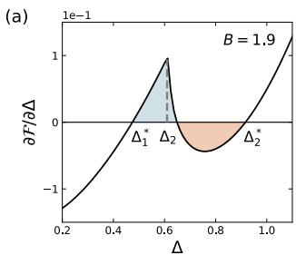

line chart

| Δ     | ∂F/∂Δ |
|-------|--------|
| 0.2   | -1.0   |
| 0.4   | 0.0    |
| 0.6   | 1.0    |
| 0.8   | -0.5   |
| 1.0   | 1.0    |

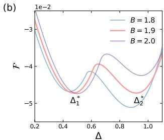

line chart

| Δ    | B = 1.8 | B = 1.9 | B = 2.0 |
|------|---------|---------|---------|
| 0.2  | -3.0    | -3.0    | -3.0    |
| 0.4  | -4.5    | -4.5    | -4.5    |
| 0.6  | -4.0    | -4.0    | -4.0    |
| 0.8  | -4.5    | -4.5    | -4.5    |
| 1.0  | -3.0    | -3.0    | -3.0    |

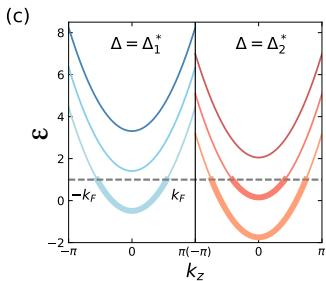

line chart

| kz       | Δ = Δ₁* | Δ = Δ₂* |
| -------- | ------- | ------- |
| -π       | 8       | 6       |
| 0        | 3       | 2       |
| π        | 8       | 6       |

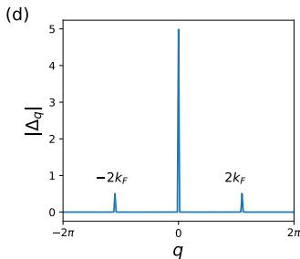  
FIG. 1. First-order phase transitions. (a) $\frac { \partial \mathcal { F } } { \partial \Delta }$ of free energy $\mathcal { F }$ at $B = 1 . 9$ for $D = 3$ and $\mu = 1$ , which is near the transition between $N = 1$ and $N = 2$ phases. (b) $\mathcal { F } ( \Delta )$ for different $B ,$ where two local minima at ${ \boldsymbol { \Delta } } _ { 1 } ^ { * }$ to ${ \boldsymbol { \Delta } } _ { 2 } ^ { * }$ compete, leading to a first order phase transition. (c) LL band dispersions of the two ground states at equal free energy $\mathcal { F } ( \Delta _ { 1 } ^ { * } ) = \mathcal { F } ( \Delta _ { 2 } ^ { * } )$ . The dashed line denotes the Fermi level. (d) Ground state calculated at $B = 2$ and $L _ { z } = 1 0 0$ by keeping all $\Delta _ { q } ,$ , which shows a major component at $q = 0$ and small Peierls CDW components at $q = \pm 2 k _ { F }$ .

The model in Eq. (2) exhibits the standard Peierls instability at zero temperature: if the n-th quasi-1D LL band has Fermi momentum $k _ { F , n } , \mathrm { ~ a ~ }$ nonzero CDW gap $\Delta _ { \pm 2 k _ { F , n } }$ will develop, where $\begin{array} { r } { \Delta _ { q } = \frac { 1 } { \sqrt { L _ { z } } } \int d z e ^ { - i q z } \Delta ( z ) } \end{array}$ is the Fourier transform of $\Delta ( z )$ . However, such Peierls CDWs cannot give rise to the 3D Hall plateaus. To see this, note that each $^ { 6 } \mathrm { s t a t e } ^ { 5 }$ of the quasi-1D bands is a LL with Chern number 1 in the $x { - } y$ plane, so the total Chern number of occupied states below the CDW gap is $\begin{array} { r } { C _ { \mathrm { t o t } } = \sum _ { n } 2 k _ { F , n } L _ { z } / 2 \pi = n _ { 1 D } L _ { z } = 2 \pi n _ { 3 D } L _ { z } / B } \end{array}$ , which leads to Hall and longitudinal resistivities

$$
\rho_ {x y} = \frac {L _ {z}}{C _ {\mathrm{tot}}} = \frac {B}{2 \pi n _ {3 D}}, \quad \rho_ {x x} = 0. \tag {3}
$$

With $n _ { 3 D }$ being a constant in the system, $\rho _ { x y } \propto B$ gives no plateaus.

First order phase transition. The key observation of this paper is, additional to the Peierls instability, the ground state of model in Eq. (2) exhibits inevitable first order phase transitions when the number of occupied quasi-1D LL bands jumps. We minimize the zero temperature free energy $\mathcal { F } = \langle H \rangle - \mu n _ { 3 D }$ at fixed chemical potential $\mu ,$ allowing the electron density $n _ { 3 D }$ to vary. The minimization is done using the numerical method of gradient descent combined with annealing with respect to all $\Delta _ { q }$ (see SM [29] Sec. II). In the entire range of B from 0 to the quantum limit, we find a predominantly large mean field component $\Delta _ { 0 }$ at $q = 0 ,$ , as accompanied by small Peierls CDW components $\Delta _ { q }$ at $q ~ = ~ \pm 2 k _ { F , n }$ (see quantitative plots in SM [29] Fig. S3), where $k _ { F , n }$ is the Fermi momentum of the n-th occupied quasi-1D band. An example is shown in Fig. 1(d). The small Peierls CDWs is also consistent with the Peierls theory prediction $\Delta _ { 2 k _ { F } } \propto \exp ( - 2 \pi ^ { 2 } k _ { F } / B )$ (SM [29] Sec. III).

Given the irrelevance of the small Peierls CDWs as argued in Eq. (3), and the lack of experimental evidence of CDWs [19–21, 23], hereafter we ignore all the components $\Delta _ { q \neq 0 }$ , and keep only the $q = 0$ mean field component $\Delta _ { 0 }$ . This amounts assuming a spatially uniform mean field (e.g. uniform strain) $\Delta ( z ) = \Delta _ { 0 } / \sqrt { L _ { z } } = \Delta$ . By Eq. (2), this effectively shifts the chemical potential of electrons from $\mu$ to $\mu + D \Delta$ , and changes the electron density $n _ { 3 D }$ accordingly. In the $B  0$ limit, where the electrons are 3D, for quadratic electron dispersion this yields a zero-temperature free energy

$$
\lim _ {B \rightarrow 0} \mathcal {F} (\Delta) = - \frac {2 \sqrt {2}}{1 5 \pi^ {2}} (\mu + D \Delta) ^ {\frac {5}{2}} + \frac {1}{2} \Delta^ {2} + \frac {\beta}{4} \Delta^ {4}. \tag {4}
$$

Minimizing F would give a spontaneous nonzero $\Delta .$

At $B > 0$ at zero temperature, we define $N \in \mathbb { Z } _ { > 0 }$ as the number of occupied (i.e. having nonzero electron density) quasi-1D LL bands, which decreases as $B$ increases. With interaction $D > 0$ , assume the free energy $\mathcal { F } ( \Delta )$ $\begin{array} { r } { \Delta _ { N } = \frac { \epsilon _ { N , 0 } ( B ) - \mu } { D } } \end{array}$ D some $N > 0$ . Then, the N-th LL band is occupied (unoccupied) when $\Delta > \Delta _ { N } \ : \left( \Delta \leq \Delta _ { N } \right)$ , and its Fermi momentum $k _ { F , N } \propto \sqrt { \Delta - \Delta _ { N } }$ if occupied. This leads to a universal form of free energy in the vicinity of $\Delta _ { N }$ [29]:

$$
\mathcal {F} (\Delta) = \mathcal {F} _ {N - 1} (\Delta) - b (\Delta - \Delta_ {N}) ^ {\frac {3}{2}} \Theta (\Delta - \Delta_ {N}), \tag {5}
$$

where $\mathcal { F } _ { N - 1 } ( \Delta )$ is a smooth function representing the free energy of the first $N - 1$ bands, $b = \sqrt { 2 } B D ^ { \frac { 3 } { 2 } } / 3 \pi ^ { 2 }$ for quadratic dispersion, and $\Theta ( x )$ is the Heaviside function which is 1 for $x > 0$ and 0 for $x \le 0$ . This leads to $\begin{array} { r } { \frac { \partial \mathcal { F } } { \partial \Delta } \simeq c ( \Delta - \Delta _ { N - 1 } ^ { * } ) - \frac { 3 b } { 2 } \sqrt { \Delta - \Delta _ { N } } \Theta ( \Delta - \Delta _ { N } ) } \end{array}$ , where ${ \boldsymbol { \Delta } } _ { N - 1 } ^ { * }$ is the point $\mathcal { F } _ { N - 1 } ( \Delta )$ reaches its minimum, and $\begin{array} { r } { c = \frac { \partial ^ { 2 } \mathcal { F } _ { N - 1 } } { \partial \Delta ^ { 2 } } > 0 } \end{array}$ ∂2FN−1∂∆2 > 0 is its second derivative. This implies $\dot { \overline { { { \partial \Delta } } } }$ always increases (decreases) with respect to $\Delta$ before (after) hitting $\Delta _ { N }$ , as shown in Fig. 1(a). Therefore, when ${ \Delta } _ { N - 1 } ^ { * }$ approaches $\Delta _ { N }$ sufficiently closely from below, two competing local minima ${ \Delta } _ { N - 1 } ^ { * }$ and $\Delta _ { N } ^ { * }$ with $\begin{array} { r } { \frac { \partial \mathcal { F } } { \partial \Delta } = 0 } \end{array}$ inevitably occur $( \mathrm { F i g . 1 ( a ) , ( b ) } )$ , which have equal free energies $\mathcal { F } ( \Delta _ { N - 1 } ^ { * } ) = \mathcal { F } ( \Delta _ { N } ^ { * } )$ when the blue and orange shaded areas in Fig. 1(a) are equal. Increasing B thus leads to a first order phase transition of $\Delta$ jumping from $\Delta _ { N } ^ { * }$ to ${ \Delta } _ { N - 1 } ^ { * }$ , and the number of occupied bands jumping from N to $N - 1$ , as shown in Fig. $1 ( \mathrm { b } ) \mathrm { - ( c ) }$ .

Such first order phase transitions are inevitable, which are the Stoner instability induced by the diverging density of states (DOS) at the 1D LL band bottoms in Eq. (1). To verify this, we calculate the mean field $\Delta ^ { * } ( \mu , B )$ minimizing the free energy $\mathcal { F }$ using parameters estimated for $\mathrm { Z r T e _ { 5 } / H f T e _ { 5 } }$ . We fix the free parameter $\zeta$ such that $a _ { L } = 2 5 . 7 \mathrm { n m }$ is the magnetic length of 1T field, making the dimensionless $B$ equal to the physical magnetic field $B ^ { \prime }$ in Tesla. This yields an estimation $E _ { 0 } \sim 0 . 5 \mathrm { m e V }$ . Assuming $\Delta$ is mainly contributed by the bulk strain from the acoustic phonon field [17, 28, 30– $3 2 ]$ , we set $D = 3$ as a legitimate coupling strength in $\mathrm { Z r T e _ { 5 } / H f T e _ { 5 } }$ (see SM [29]), and set $\beta = 0 . 2$ which does not sensitively affect the phase diagram. Experiments [17–20] estimate a carrier density $n _ { 3 D } ^ { \prime } \sim 1 0 ^ { 1 7 } \mathrm { { c m } ^ { - 3 } }$ , or a dimensionless density $n _ { 3 D } \sim 0 . 3$ .

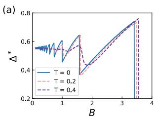

line chart

| B    | T = 0  | T = 0.2 | T = 0.4 |
|------|--------|---------|---------|
| 0.0  | 0.55   | 0.55    | 0.55    |
| 1.0  | 0.55   | 0.55    | 0.55    |
| 2.0  | 0.65   | 0.40    | 0.45    |
| 3.0  | 0.75   | 0.75    | 0.75    |
| 3.5  | 0.80   | 0.80    | 0.80    |
| 4.0  | 0.80   | 0.80    | 0.80    |

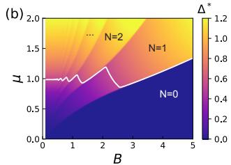

area chart

| B    | μ (N=0) | μ (N=1) | μ (N=2) |
|------|---------|---------|---------|
| 0.0  | 0.0     | 0.0     | 0.0     |
| 1.0  | 0.5     | 0.8     | 1.0     |
| 2.0  | 1.0     | 1.2     | 1.5     |
| 3.0  | 1.5     | 1.0     | 1.2     |
| 4.0  | 1.8     | 0.8     | 1.0     |
| 5.0  | 2.0     | 0.6     | 0.8     |

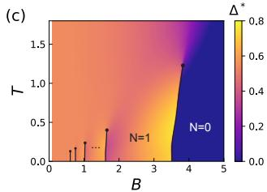

heatmap

| B    | T    | Δ*   |
|------|------|------|
| 0.5  | 0.1  | 0.0  |
| 1.0  | 0.2  | 0.0  |
| 1.5  | 0.4  | 0.0  |
| 2.0  | 0.5  | 0.0  |
| 3.0  | 0.6  | 0.0  |
| 4.0  | 1.2  | 0.8  |
| 5.0  | 1.5  | 0.8  |

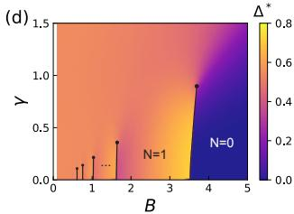

heatmap

| B    | Y    | Δ*   |
|------|------|------|
| 0.5  | 0.1  | 0.0  |
| 1.0  | 0.2  | 0.0  |
| 1.5  | 0.4  | 0.0  |
| 2.0  | 0.9  | 0.0  |
| 3.5  | 1.0  | 0.0  |

FIG. 2. Phase diagram for quadratic dispersion in Eq. (1). (a) $\Delta ^ { * } ( \mu = 1 , B )$ for $T = 0 , 0 . 2$ , and 0.4. (b) Color map of $\Delta ^ { * } ( \mu , B )$ at $T = 0 .$ , with the white contour indicating constant carrier density $n _ { 3 D } = 0 . 3 . ~ \mathrm { ( c ) \mathrm { - ( d ) } }$ Phase diagrams at $\mu = 1$ , for (c) finite T (no disorder), and (d) finite disorder DOS broadening γ at $T = 0$ . First (Second) order transitions are indicated by black lines (dots).

Here we focus on the quadratic dispersion in Eq. (1) (see SM [29] Sec. IV for the Dirac dispersion results). Fig. 2(a) shows $\Delta ^ { * } ( \mu = 1 , B )$ at different dimensionless temperatures $T = k T ^ { \prime } / E _ { 0 }$ . At zero-temperature, sharp first-order jumps occur as the occupied LL band number $N$ changes, and the jumps are larger for smaller N (larger $B )$ . The jumps at the larger N are smeared out at higher critical temperatures. Fig. 2(b) shows the phase diagram with respect to $\mu , B$ at zero temperature. Fig. 2(c) shows the finite temperature phase diagram with respect to $B , T$ for fixed $\mu = 1$ (which is around the $n _ { 3 D } \sim 0 . 3 \mathrm { l i n e } )$ , where we find the first-order phase boundaries end at second-order critical points with the critical temperature $T _ { c }$ roughly linear in B. With $E _ { 0 } \sim 0 . 5 \mathrm { m e V }$ estimated earlier, Fig. 2(c) implies $T _ { c } \lesssim$ 10K, which is consistent with the relevant temperature range in the experiments [17–20].

Short-range correlated disorders could lower the LL band bottom DOS and eventually eliminate the phase transitions. Fig. 2(d) shows the zero temperature phase diagram at $\mu = 1$ with a Gaussian broadening of standard deviation $\gamma$ (defined as disorder strength) added to the DOS (see SM [29] Sec. V), in which we find the critical $\gamma _ { c }$ grows linearly in B.

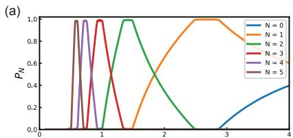

line chart

| x    | N = 0 | N = 1 | N = 2 | N = 3 | N = 4 | N = 5 |
| ---- | ----- | ----- | ----- | ----- | ----- | ----- |
| 0.0  | 0.0   | 0.0   | 0.0   | 0.0   | 0.0   | 0.0   |
| 0.5  | 0.0   | 0.0   | 0.0   | 0.0   | 0.0   | 0.9   |
| 1.0  | 0.0   | 0.0   | 0.0   | 0.9   | 0.0   | 0.0   |
| 1.5  | 0.0   | 0.0   | 1.0   | 0.0   | 0.0   | 0.0   |
| 2.0  | 0.0   | 0.8   | 0.6   | 0.0   | 0.0   | 0.0   |
| 2.5  | 0.2   | 1.0   | 0.2   | 0.0   | 0.0   | 0.0   |
| 3.0  | 0.4   | 1.0   | 0.0   | 0.0   | 0.0   | 0.0   |
| 3.5  | 0.6   | 1.0   | 0.0   | 0.0   | 0.0   | 0.0   |
| 4.0  | 1.0   | 1.0   | 0.0   | 0.0   | 0.0   | 0.6   |

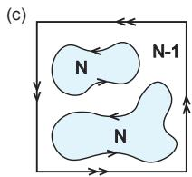

flowchart

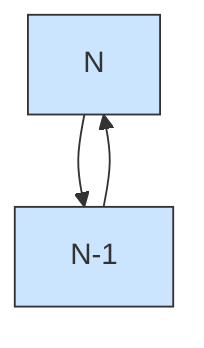

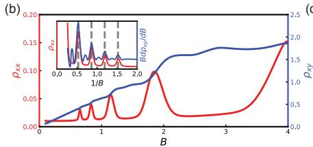

line chart

| B    | ρ_xx  | ρ_xy |
|------|-------|------|
| 0.0  | 0.00  | 0.0  |
| 0.5  | 0.05  | 0.5  |
| 1.0  | 0.10  | 1.0  |
| 1.5  | 0.15  | 1.5  |
| 2.0  | 0.20  | 2.0  |
| 2.5  | 0.15  | 2.0  |
| 3.0  | 0.10  | 2.0  |
| 3.5  | 0.05  | 2.0  |
| 4.0  | 0.00  | 2.0  |

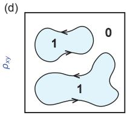

text_image

(d)
ρxy
1
0
1

FIG. 3. Phase separation and percolation-induced Hall resistivity quasi-plateaus. (a) Spatial fractions pN of different phases $N$ up to 4 (labels in the legend), and (b) $\rho _ { x y }$ (blue) and $\rho _ { x x }$ (red) with respect to B (inset: plots versus $1 / B )$ , calculated along the $n _ { 3 D } = 0 . 3$ contour in Fig. 2(c). (c)-(d) Top view illustration of phase separation states for (c) phase N not percolating and phase $N - 1$ percolating, and (d) phase 1 not percolating and phase 0 percolating (which gives an insulator).

Phase separation and percolation. In Fig. 2(b) calculated by fixing chemical potential $\mu ,$ the 3D electron density $n _ { 3 D }$ jumps across a first order phase boundary. In physical materials, $n _ { 3 D }$ is fixed, while $\mu$ is not. Therefore, the system should evolve with B along the constant n3D contour, for example the white contour with $n _ { 3 D } = 0 . 3$ in Fig. 2(b). When the contour lies on the phase boundary between phases $N - 1$ and $N$ , the system will enter a phase separation state of both phases with spatial fractions $p _ { N - 1 }$ and $p _ { N } = 1 - p _ { N - 1 }$ , respectively, which is robust in 3D [33]. The fractions are determined by

$$
n _ {3 D} ^ {(N - 1)} p _ {N - 1} + n _ {3 D} ^ {(N)} p _ {N} = n _ {3 D}, \tag {6}
$$

where n3D $n _ { 3 D } ^ { ( N - 1 ) }$ (N−1) and n(N)3D $n _ { 3 D } ^ { ( N ) }$ are the densities of phases $N - 1$ and N adjacent to the phase boundary $( n _ { 3 D } ^ { ( { \bar { N } } ) } > n _ { 3 D } ^ { ( N - 1 ) } )$ > n3D (N−1)). Fig. 3(a) shows the fractions $p _ { N }$ calculated along the white $n _ { 3 D } = 0 . 3$ contour in Fig. 2(b).

The two phases N −1 and N are expected to form randomly shaped domains, as driven by any spatially weakly varying random potentials. According to the 3D percolation theory, phase N (phase N −1) can percolate to infinity if and only if its spatial fraction $p _ { N } > p _ { c } \left( p _ { N - 1 } > p _ { c } \right)$ , where the critical threshold $p _ { c } \simeq 0 . 3 \ [ 3 4 - 3 6 ]$ ]. Fig. 3(c) gives an illustration of phase N not percolating and phase $N - 1$ percolating. The percolation theory is known to be crucial for understanding the Hall plateaus of 2D QH effect [37–41], where a partially filled LL contributes a Hall conductance $\frac { e ^ { 2 } } { h }$ if percolating. For the phase N in 3D here, the total number of occupied LLs in the $x { - } y$ plane is $C _ { \mathrm { t o t } } ^ { ( N ) } = 2 \pi n _ { 3 D } ^ { ( N ) } L _ { z } / B$ 2πn(N)3D . Therefore, phase N has $C _ { \mathrm { t o t } } ^ { ( N ) } { - } C _ { \mathrm { t o t } } ^ { ( N - 1 ) }$ more occupied LLs than phase $N - 1$ . The (dimensionless) Hall conductivity contributed by these LLs has the form σ(1)xy $\begin{array} { r } { \sigma _ { x y } ^ { ( 1 ) } = f ( p _ { N } ) \frac { C _ { \mathrm { t o t } } ^ { ( N ) } - C _ { \mathrm { t o t } } ^ { ( N - 1 ) } } { L _ { z } } } \end{array}$ Lz , with the function $f ( p _ { N } ) > 0$ only if $p _ { N } > p _ { c } ,$ namely, if phase N percolates (such that their chiral surface states can reach the boundaries of the system). Generically, $f ( p _ { N } ) \to 1$ $p _ { N } \to 1$ $\dot { C } _ { \mathrm { t o t } } ^ { ( N - 1 ) }$ phases, thus extend across the entire system and contribute a Hall conductivity $\begin{array} { r } { \sigma _ { x y } ^ { ( 0 ) } = \frac { C _ { \mathrm { t o t } } ^ { ( N - 1 ) } } { L _ { z } } } \end{array}$ Lz With Eq. (6), we reach a total Hall conductivity $\sigma _ { x y } = \sigma _ { x y } ^ { ( 0 ) } + \sigma _ { x y } ^ { ( 1 ) }$ σxy + σ xy

$$
\sigma_ {x y} = \frac {2 \pi}{B} \left[ n _ {3 D} + (n _ {3 D} ^ {(N)} - n _ {3 D} ^ {(N - 1)}) \big (f (p _ {N}) - p _ {N} \big) \right]. \tag {7}
$$

Assuming Peierls CDW gaps are absent or smaller than the disorder strength, all the phases with $N \geq 1$ are metallic. This is consistent with the lack of experimental evidence of CDW [20, 21, 23], and finite longitudinal resistivity $\rho _ { x x }$ in experiments [18–20] (except for $\rho _ { x x }$ approaching zero in [17]). The only exception is the $N = 0$ phase, which has n(0)3D $n _ { 3 D } ^ { ( 0 ) } ~ = ~ 0$ and is insulating. Without knowing the microscopic details, we assume a Drude model form (dimensionless) longitudinal resistivity $\rho _ { x x } .$

$$
\rho_ {x x} = \frac {1}{4 \pi n _ {3 D}} \left[ \Gamma_ {0} (B) + \Gamma_ {s} \left(p _ {N} \left(1 - p _ {N}\right)\right) \right] \tag {8}
$$

where $\Gamma _ { 0 } ( B ) = \gamma _ { 0 } ( 1 + \chi _ { 0 } B ^ { 2 } )$ is the dimensionless electron scattering rate typical for magneto-resistance of metals, and $\Gamma _ { s } ( p _ { N } ( 1 - p _ { N } ) )$ is the extra scattering rate due to numerous domain walls when the system is in a phase separation state of phases N and $N - 1$ , which is peaked at $\begin{array} { r } { p _ { N } = \frac { 1 } { 2 } } \end{array}$ . As B increases, $\Gamma _ { s }$ should increase due to the larger jump of $\Delta ^ { * }$ across the domain walls between the two phases $( \mathrm { F i g . ~ 2 ( a ) } ) , \Gamma _ { s }$ should increase with $B ,$ so we take an ansatz $\Gamma _ { s } ( x ) = \gamma _ { 1 } B x ^ { 2 }$ . Here $\Gamma _ { \alpha } = \hbar \Gamma _ { \alpha } ^ { \prime } / E _ { 0 }$ in terms of dimensionful scattering rates $\Gamma _ { \alpha } ^ { \prime } \ : \left( \alpha = 0 , s \right)$ . The Hall resistivity from Eqs. (7) and (8) is then $\rho _ { x y } =$ 1+ 1−4ρ2xxσ2xy $\frac { 1 + \sqrt { 1 - 4 \rho _ { x x } ^ { 2 } \sigma _ { x y } ^ { 2 } } } { 2 \sigma _ { x y } }$ 2σxy

As a demonstration, for Eq. (7) we take $f ( p ) \ =$ $\scriptstyle { \frac { 1 } { 2 } } [ 1 + \operatorname { t a n h } ( 6 p - 3 ) ]$ which is approximately nonzero only if $p > p _ { c } \simeq 0 . 3$ , and we set $\gamma _ { 0 } = 0 . 0 4 , \chi _ { 0 } = 0 . 2 5$ and $\gamma _ { 1 } = 2$ , which give $\rho _ { x x }$ one order smaller than $\rho _ { x y }$ as is the case in experiments [17–20]. Fig. 3(b) shows $\rho _ { x x }$ and $\rho _ { x y }$ as a function of B along the constant $n _ { 3 D } = 0 . 3$ contour in Fig. 2(b). We find that $\rho _ { x y }$ exhibits quasi-plateaus when the system is in a phase separation state with one of the two phases not percolating. In contrast, when the system is uniformly in one phase, $\rho _ { x y }$ approaches the linear $B$ curve in Eq. (3). The $\rho _ { x y }$ plateaus are approximately equally spaced in $1 / B _ { ; }$ , as Fig. 3(b) inset shows. The $\rho _ { x y }$ curve we obtained qualitatively resemble the experimental observations especially of $\mathrm { H f T e _ { 5 } }$ [19]. Note that unlike the 2D QH effect where the Hall plateau transition is sharp, the $\rho _ { x y }$ quasi-plateaus here are necessarily separated by finite non-plateau regimes.

Moreover, our theory captures the experimentally observed metal-insulator transition at high magnetic fields [17–20]. This transition occurs when the system enters a phase-separated state of coexisting $N = 1$ metallic and $N = 0$ insulating domains, as illustrated in Fig. 3(d). As B increases, the electron density $n _ { 3 D } ^ { ( 1 ) }$ in the $N = 1$ metallic phase increases, thus reduces its spatial fraction $p _ { 1 } ~ \mathrm { { ( F i g . ~ 3 ( a ) ) } }$ . There is thus a critical field $B _ { c }$ of metal-insulator transition at which $p _ { 1 } ~ = ~ p _ { c }$ , such that for $B \ < \ B _ { c } \ ( B \ > \ B _ { c } )$ , the entire system is metallic (insulating). Taking $p _ { c } ~ = ~ 0 . 3 ,$ , we find $B _ { c } \ \simeq \ 8 ( \mathrm { i . e . }$ , $B _ { c } \simeq 8 \mathrm { T }$ in physical units) along the $n _ { 3 D } = 0 . 3$ contour in Fig. $2 ( \mathrm { c } )$ , the order of which matches the experiments well $( B _ { c } ^ { \prime } \simeq 6 . 7 \mathrm { T }$ in [17]).

Discussion. We have shown that the 3D metal coupled with a boson (most probably phonon) field in the disorderless limit exhibits inevitable first order phase transitions in strong magnetic fields, in which the boson mean field $\Delta ^ { * }$ jumps when the number of occupied LL bands $N$ jumps. Such phase transitions arise necessarily due to the diverging density of states at LL band bottoms, which leads to a Stoner instability. As Fig. $2 ( \mathrm { c } ) \mathrm { - ( d ) }$ shows, such phase transitions can only be observed at strong magnetic field B (exceeding the temperature $T$ and disorder strength γ of the system in dimensionless units). We note that a similar effect from the coupling between electron current and the magnetic field was proposed by Condon [42], which is however too weak to be observed experimentally. The phase transitions due to electron-phonon coupling we predicted here are well observable.

We further showed that phase separation and percolation at the first order phase transitions give a possible non-CDW explanation of the Hall resistivity quasiplateaus observed in 3D QH experiments in $\mathrm { Z r T e _ { 5 } / H f T e _ { 5 } }$ [17–20], and explains the observed large magnetic field metal-insulator transition as a percolation transition. For the parameters we estimated, the quadratic dispersion model (Figs. 2 and 3) quantitatively matches the experiments better than the massive Dirac model (see [29] Sec. IV), suggesting quadratic dispersion electrons may play a more important role in $\mathrm { Z r T e _ { 5 } / H f T e _ { 5 } }$ . An interesting future question is to investigate the critical exponents at such interacting percolation transitions. Lastly, if the boson field $\Delta ^ { * }$ originates from bulk strain (i.e. acoustic phonon), our results suggest jumps of the (dimensionful) bulk strain up to $1 0 ^ { - 4 }$ in $\mathrm { Z r T e _ { 5 } / H f T e _ { 5 } }$ at the first order phase transitions [29], and it will be intriguing to investigate how this can be measured. Qualitatively, we expect our theory to apply to any low-carrier-density anisotropic 3D metals with quadratic (or massive Dirac) low energy electron bands, such as the most recent experiment in $\mathrm { M n } ( \mathrm { B i } _ { x } \mathrm { S b } _ { 1 - x } ) _ { 4 } \mathrm { T e } _ { 7 }$ [24], although the parameters of which may differ.

Acknowledgments. We thank Claudia Felser, Priscila Rosa, Debanjan Chowdhury and Duncan Haldane for helpful discussions. This work is supported by the National Science Foundation through Princeton University’s Materials Research Science and Engineering Center DMR-2011750, and the National Science Foundation under award DMR-2141966. Additional support is provided by the Gordon and Betty Moore Foundation through Grant GBMF8685 towards the Princeton theory program.

[1] K. v. Klitzing, G. Dorda, and M. Pepper, New method for high-accuracy determination of the fine-structure constant based on quantized hall resistance, Phys. Rev. Lett. 45, 494 (1980).  
[2] R. B. Laughlin, Quantized hall conductivity in two dimensions, Phys. Rev. B 23, 5632 (1981).  
[3] D. J. Thouless, M. Kohmoto, M. P. Nightingale, and M. den Nijs, Quantized hall conductance in a twodimensional periodic potential, Phys. Rev. Lett. 49, 405 (1982).  
[4] B. I. Halperin, Possible States for a Three-Dimensional Electron Gas in a Strong Magnetic Field, Japanese Journal of Applied Physics 26, 1913 (1987).  
[5] G. Montambaux and M. Kohmoto, Quantized hall effect in three dimensions, Phys. Rev. B 41, 11417 (1990).  
[6] M. Kohmoto, B. I. Halperin, and Y.-S. Wu, Diophantine equation for the three-dimensional quantum hall effect, Phys. Rev. B 45, 13488 (1992).  
[7] M. Koshino, H. Aoki, K. Kuroki, S. Kagoshima, and T. Osada, Hofstadter butterfly and integer quantum hall effect in three dimensions, Phys. Rev. Lett. 86, 1062 (2001).  
[8] F. D. M. Haldane, Berry curvature on the fermi surface: Anomalous hall effect as a topological fermi-liquid property, Phys. Rev. Lett. 93, 206602 (2004).  
[9] A. A. Burkov and L. Balents, Weyl semimetal in a topological insulator multilayer, Phys. Rev. Lett. 107, 127205 (2011).  
[10] J. Wang, B. Lian, and S.-C. Zhang, Dynamical axion field in a magnetic topological insulator superlattice, Phys. Rev. B 93, 045115 (2016).  
[11] B. Lian and S.-C. Zhang, Weyl semimetal and topological phase transition in five dimensions, Phys. Rev. B 95, 235106 (2017).  
[12] J.-X. Yin, W. Ma, T. A. Cochran, X. Xu, S. S. Zhang, H.-J. Tien, N. Shumiya, G. Cheng, K. Jiang, B. Lian, Z. Song, G. Chang, I. Belopolski, D. Multer, M. Litskevich, Z.-J. Cheng, X. P. Yang, B. Swidler, H. Zhou, H. Lin, T. Neupert, Z. Wang, N. Yao, T.-R. Chang, S. Jia, and M. Zahid Hasan, Quantum-limit chern topological magnetism in tbmn6sn6, Nature 583, 533–536 (2020).  
[13] C. M. Wang, H.-P. Sun, H.-Z. Lu, and X. C. Xie, 3d quantum hall effect of fermi arcs in topological semimetals, Phys. Rev. Lett. 119, 136806 (2017).  
[14] F. Xiong, C. Honerkamp, D. M. Kennes, and T. Nag, Un-  
derstanding the three-dimensional quantum hall effect in generic multi-weyl semimetals, Phys. Rev. B 106, 045424 (2022).  
[15] Y. Liu, X. Yuan, C. Zhang, Z. Jin, A. Narayan, C. Luo, Z. Chen, L. Yang, J. Zou, X. Wu, S. Sanvito, Z. Xia, L. Li, Z. Wang, and F. Xiu, Zeeman splitting and dynamical mass generation in Dirac semimetal ZrTe5, Nature Communications 7, 12516 (2016).  
[16] H. Wang, H. Liu, Y. Li, Y. Liu, J. Wang, J. Liu, J.-Y. Dai, Y. Wang, L. Li, J. Yan, D. Mandrus, X. C. Xie, and J. Wang, Discovery of log-periodic oscillations in ultraquantum topological materials, Science Advances 4, 10.1126/sciadv.aau5096 (2018).  
[17] F. Tang, Y. Ren, P. Wang, R. Zhong, J. Schneeloch, S. A. Yang, K. Yang, P. A. Lee, G. Gu, Z. Qiao, and L. Zhang, Three-dimensional quantum Hall effect and metal–insulator transition in $\mathrm { Z r T e _ { 5 } }$ , Nature 569, 537 (2019).  
[18] P. Wang, Y. Ren, F. Tang, P. Wang, T. Hou, H. Zeng, L. Zhang, and Z. Qiao, Approaching three-dimensional quantum Hall effect in bulk HfTe5, Phys. Rev. B 101, 161201 (2020).  
[19] S. Galeski, X. Zhao, R. Wawrzy´nczak, T. Meng, T. F¨orster, P. M. Lozano, S. Honnali, N. Lamba, T. Ehmcke, A. Markou, Q. Li., G. Gu, W. Zhu, J. Wosnitza, C. Felser, G. F. Chen, and J. Gooth, Unconventional Hall response in the quantum limit of HfTe5, Nature Communications 11, 5926 (2020).  
[20] S. Galeski, T. Ehmcke, R. Wawrzy´nczak, P. M. Lozano, K. Cho, A. Sharma, S. Das, F. K¨uster, P. Sessi, M. Brando, R. K¨uchler, A. Markou, M. K¨onig, P. Swekis, C. Felser, Y. Sassa, Q. Li, G. Gu, M. V. Zimmermann, O. Ivashko, D. I. Gorbunov, S. Zherlitsyn, T. F¨orster, S. S. P. Parkin, J. Wosnitza, T. Meng, and J. Gooth, Origin of the quasi-quantized Hall effect in ZrTe5, Nature Communications 12, 3197 (2021).  
[21] Y. Tian, N. Ghassemi, and J. H. Ross, Gap-Opening Transition in Dirac Semimetal ZrTe5, Phys. Rev. Lett. 126, 236401 (2021).  
[22] W. Wu, Z. Shi, Y. Du, Y. Wang, F. Qin, X. Meng, B. Liu, Y. Ma, Z. Yan, M. Ozerov, C. Zhang, H.-Z. Lu, J. Chu, and X. Yuan, Topological Lifshitz transition and onedimensional Weyl mode in HfTe5, Nature Materials 22, 84 (2023).  
[23] M. M. Piva, R. Wawrzy´nczak, N. Kumar, L. O. Kutelak, G. A. Lombardi, R. D. dos Reis, C. Felser, and M. Nicklas, Importance of the semimetallic state for the quantum Hall effect in HfTe5, Phys. Rev. Mater. 8, L041202 (2024).  
[24] Y. Guan, A. Chatterjee, T. Bivens, S. Huat Lee, A. Honma, H. Oka, J. D. Vega Bazantes, R. Zhang, D. Graf, J. Sun, S. Souma, T. Sato, Y. P. Chen, Y. Wang, C. Liu, and Z. Mao, Discovery of a Highly Anisotropic Type-II Ferromagnetic Weyl State Exhibiting a 3D Quantum Hall Effect, arXiv e-prints , arXiv:2503.07564 (2025), arXiv:2503.07564 [cond-mat.mtrl-sci].  
[25] F. Qin, S. Li, Z. Z. Du, C. M. Wang, W. Zhang, D. Yu, H.-Z. Lu, and X. C. Xie, Theory for the charge-densitywave mechanism of 3d quantum hall effect, Phys. Rev.  
Lett. 125, 206601 (2020).  
[26] H. Geng, G. Y. Qi, L. Sheng, W. Chen, and D. Y. Xing, Theoretical study of the three-dimensional quantum hall effect in a periodic electron system, Phys. Rev. B 104, 205305 (2021).  
[27] Y. Zhang, C. Wang, L. Yu, G. Liu, A. Liang, J. Huang, S. Nie, X. Sun, Y. Zhang, B. Shen, J. Liu, H. Weng, L. Zhao, G. Chen, X. Jia, C. Hu, Y. Ding, W. Zhao, Q. Gao, C. Li, S. He, L. Zhao, F. Zhang, S. Zhang, F. Yang, Z. Wang, Q. Peng, X. Dai, Z. Fang, Z. Xu, C. Chen, and X. J. Zhou, Electronic evidence of temperature-induced lifshitz transition and topological nature in zrte5, Nature Communications 8, 10.1038/ncomms15512 (2017).  
[28] C. Wang, Thermodynamically induced transport anomaly in dilute metals zrte5 and hfte5, Phys. Rev. Lett. 126, 126601 (2021).  
[29] See Supplemental Material for details.  
[30] B. Fu, H.-W. Wang, and S.-Q. Shen, Dirac polarons and resistivity anomaly in zrte5 and hfte5, Phys. Rev. Lett. 125, 256601 (2020).  
[31] G. N. Kamm, D. J. Gillespie, A. C. Ehrlich, T. J. Wieting, and F. Levy, Fermi surface, effective masses, and dingle temperatures of zrte5 as derived from the shubnikov– de haas effect, Phys. Rev. B 31, 7617 (1985).  
[32] A. Jain, S. P. Ong, G. Hautier, W. Chen, W. D. Richards, S. Dacek, S. Cholia, D. Gunter, D. Skinner, G. Ceder, and K. a. Persson, The Materials Project: A materials genome approach to accelerating materials innovation, APL Materials 1, 011002 (2013).  
[33] Y. Imry and S.-k. Ma, Random-field instability of the ordered state of continuous symmetry, Phys. Rev. Lett. 35, 1399 (1975).  
[34] M. B. Isichenko, Percolation, statistical topography, and transport in random media, Rev. Mod. Phys. 64, 961 (1992).  
[35] J. T. Chalker and A. Dohmen, Three-dimensional disordered conductors in a strong magnetic field: Surface states and quantum hall plateaus, Phys. Rev. Lett. 75, 4496 (1995).  
[36] Z.-D. Song, B. Lian, R. Queiroz, R. Ilan, B. A. Bernevig, and A. Stern, Delocalization transition of a disordered axion insulator, Phys. Rev. Lett. 127, 016602 (2021).  
[37] J. T. Chalker and P. D. Coddington, Percolation, quantum tunnelling and the integer hall effect, Journal of Physics C: Solid State Physics 21, 2665 (1988).  
[38] A. M. M. Pruisken, Universal singularities in the integral quantum hall effect, Phys. Rev. Lett. 61, 1297 (1988).  
[39] B. Huckestein and B. Kramer, One-parameter scaling in the lowest landau band: Precise determination of the critical behavior of the localization length, Phys. Rev. Lett. 64, 1437 (1990).  
[40] Y. Huo and R. N. Bhatt, Current carrying states in the lowest landau level, Phys. Rev. Lett. 68, 1375 (1992).  
[41] J. Wang, B. Lian, and S.-C. Zhang, Universal scaling of the quantum anomalous hall plateau transition, Phys. Rev. B 89, 085106 (2014).  
[42] J. H. Condon, Nonlinear de haas-van alphen effect and magnetic domains in beryllium, Phys. Rev. 145, 526 (1966).