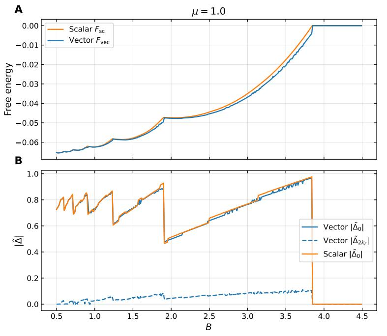

Dear Editor,

Hereby we would like to resubmit our manuscript to Physical Review Letters.

We thank the referees for their careful reading of our manuscript and for their insightful comments for improving our manuscript. We have revised the manuscript to address the technical points raised, including adding new calculations showing the phase diagrams at finite temperature and with short-range disorder effects, and showing a more detailed comparison between our simplified theory and the fully generic theory containing all momentum components of the mean field. As the first referee commented, our work provides a greatly simplified and rather universal theory for understanding the 3DQH effect without the need of CDW. We respectfully disagree with the second referee’s assessment regarding the novelty of our work, for the reasons we explained in details in the reply. We believe the mechanism of a non-CDW, interaction-induced first-order transition provides a promising robust explanation for the recent experiments.

Please find in the below the list of changes and our detailed reply to the referee report. Your favorable consideration of our manuscript for PRL would be greatly appreciated.

Sincerely,

Kaiyuan Gu, Kai Torrens and Biao Lian

## Summary of Changes

• We added the full details of updated numerical calculation and convergence tests, which has an enhanced performance compared to previous calculations and demonstrates that our algorithm indeed finds the correct ground state being that with only $\Delta _ { 0 }$ and $\Delta _ { 2 k _ { F } }$ being non-zero. The updated numerical methods also allow us to calculate the phase diagram at finite temperature. The whole discussion is expanded in Supplementary Materials Sec. II.  
• We calculated and added both the finite-temperature and the disorder-broadening phase diagrams (employing the method), to demonstrate the suppression of the firstorder transitions by temperature and disorder. The result is shown in Fig.2c and 2d, and the details of implementation of disorder is explained in supplementary materials Sec. V.  
• We added the analytical result on the ground state with competition between $q = 0$ (uniform strain) and $q = 2 k _ { F }$ (CDW) components based on free energy minimization, as is in Supplementary Materials Sec. III.  
• We included an analysis of the massive Dirac dispersion with the correct spin degeneracy, as in Supplementary Materials Sec. IV.  
• We corrected a typographical error in the definition of the critical field $\Delta _ { N }$ as suggested by Referee 1.

• We included a percolation schematic in Fig. 3, to better visualize the phase transition.  
• We have added a new reference (Ref. [24] in our manuscript), which reports a recent experiment on 3D QH effect in $\mathrm { M n ( B i } _ { x } \mathrm { S b } _ { 1 - x } \mathrm { ) } _ { 4 } \mathrm { T e } _ { 7 }$ .

## Reply to the report of the first referee

Referee 1 summary: 3D quantum Hall effect was successfully observed in recent ZrTe5 and HfTe5 experiments under strong magnetic fields. While the initially proposed CDW was not demonstrated in subsequent experiments, the underlying mechanisms are still under debate. The authors of this manuscript (MS) consider the electrons coupled to the boson fields in 3D quantum Hall systems and find that without CDW, the system can exhibit inevitable first-order phase transitions when the number of occupied LLs jumps. Then the system may be driven into a phase separation state with percolation transitions. Thus, the experimental results, including the quasiplateaus Hall resistivity and the metal-insulator transition, can be explained. This MS adopts a dimensionless model, which greatly simplifies the calculations and has certain universality. I suggest that the authors address the following concerns.

We sincerely thank the referee for recognizing the merit and importance of our manuscript. As the referee commented, a significant goal is to propose a mechanism for understanding the 3DQH effect in the absence of CDWs, since CDWs were not observed in subsequent experiments. In the updated manuscript, in addition to addressing the questions raised by the referee, we have added a systematic calculation of the phase diagram at finite temperature $T > 0$ , as well as in the presence of Gaussian broadening of the density of states (simulating the effect of short-range disorders), and the resulting phase diagrams are shown in the updated Fig. 2(c) and 2(d). (In the previous manuscript, only zero temperature phase diagram was studied.) Particularly, the critical temperature are found to be on the order of $T _ { c } \lesssim 1 0 \mathrm { K }$ using our estimated parameters, up to which the first order phase transitions are robust. This also match the relevant temperature scales in the experiments, which further supports the physical relevance of our theory. We have also improved our method for the full mean field calculation considering all the $\Delta _ { q }$ components, which rigorously demonstrates the validity of our simplified picture of keeping $\Delta _ { 0 }$ only (at both zero and finite temperatures).

We have addressed in details the questions and comments of the referee in the below. We believe this addresses all the concerns raised by the referee, and we would greatly appreciate their favorable consideration of our work for PRL.

Comment 1: The authors use both quadratic dispersion and massive Dirac dispersion to describe the low carrier density metals $\mathrm { Z r T e _ { 5 } }$ and $\mathrm { H f T e _ { 5 } }$ . In the manuscript (MS), many calculations and arguments are only based on quadratic dispersion, such as Eq. (5) and below, and Fig. 3. Moreover, the quasi-plateau Hall resistivity and the metal-insulator transition are also derived from quadratic dispersion. My question is whether the simplified quadratic dispersion model can correctly capture the lowenergy behaviors in $\mathrm { Z r T e _ { 5 } }$ and $\mathrm { H f T e _ { 5 } }$ , since their ground states were suggested to lie near the phase boundary between the strong topological insulator and weak topological insulator.

Response: We thank the referee for raising this concern. The goal of our study is to reveal a novel universal mechanism for 3D metals to have quasi-quantized Hall resistances induced by interaction. While the band structures of $\mathrm { Z r T e _ { 5 } }$ and $\mathrm { H f T e _ { 5 } }$ are near the boundary between strong topological insulator and weak topological insulator as the referee points out, previous experimental and theoretical studies suggest the presence of both Dirac and quadratic dispersion electrons in $\mathrm { Z r T e _ { 5 } }$ and $\mathrm { H f T e _ { 5 } }$ (see Refs [18,21,27,28] of our manuscript). We were mainly focusing on the discussion of quadratic dispersion in the main text, mainly for two reasons: (1) The central idea of our work is that the diverging density of states at the 1D LL band bottoms leads to a Stoner instability and inevitable first order phase transitions. Both the quadratic and massive Dirac dispersions provide such diverging density of states, thus they are qualitatively not different. (2) Despite still being a simplified model, with some straightfowardly estimated parameters for these two materials (given in our supplementary material), we find the quadratic dispersion model quantitatively matches better with the experiments of $\mathrm { Z r T e _ { 5 } }$ and $\mathrm { H f T e _ { 5 } }$ , and thus may be closer to the actual system. In our updated draft, we have added Supplementary Material section IV, in which we present results calculated with the massive Dirac model, which shows the same kind of inevitable first order phase transitions giving jumps in $\Delta$ . For the model parameters we adopted (based on literature), the massive Dirac model does not quantitatively match well with the experiments, which suggests either our parameters are less realistic, or the quadratic dispersion electron bands play a more important role in $\mathrm { Z r T e _ { 5 } }$ and HfTe5. We have added a comment on this in the last paragraph of the main text.

Comment 2: The authors assume that the mean-field components $\Delta _ { \pm 2 k _ { F } }$ are ignored and only $\Delta _ { 0 }$ is considered, which are key points of their calculations. To my understanding, whether $\Delta _ { 0 }$ or $\Delta _ { \pm 2 k _ { F } }$ dominates depends on the lowering of the free energy $F$ , but not their relative magnitudes. Please provide more evidence of the F variations due to $\Delta _ { 0 }$ and $\Delta _ { \pm 2 k _ { F } }$ . On the other hand, the common CDW theory only focuses on the wave vector $Q = \pm 2 k _ { F }$ . Which physical factors determine the dominance of $Q = 0$ in this MS?

Response: The referee is correct that the values of $\Delta _ { 0 }$ and $\Delta _ { \pm 2 k _ { F } }$ is determined by minimizing the free energy $F$ , instead of being assumed. This is exactly what we did numerically before we make the approximation to drop $\Delta _ { \pm 2 k _ { F } }$ . As our main text Fig. 1(d) indicated, by minimizing the free energy $F ,$ we always find that $\Delta _ { 0 }$ is much larger than $\Delta _ { \pm 2 k _ { F } }$ . We have further added a detailed explanation of our numerical methods (which is improved in the current draft to a method combining gradient descent with annealing) in the SM Section II, and Fig. S3 (or Fig. 1 below) shows $\Delta _ { 0 }$ and $\Delta _ { \pm 2 k _ { F } }$ as a function of magnetic field B by minimizing the total free energy F with all the components $\Delta _ { q }$ kept (denoted by blue lines labeled by ’Vector’). The results almost always give $\Delta _ { 0 }$ much larger than $\Delta _ { \pm 2 k _ { F } }$ , and both the values of $\Delta _ { 0 }$ and the free energy are very close to that given by the calculation keeping only the $\Delta _ { 0 }$ (orange lines labeled by ’Scalar’).

  
Figure 1: Ground-state energy and order parameter as a function of magnetic field at $\mu = 1$ . (A) Ground-state energy per site from the scalar approximation $( F _ { \mathrm { s c } }$ , orange) and the full vector optimisation $( \boldsymbol { F } _ { \mathrm { v e c } } , \mathrm { b l u e } )$ . The two curves are nearly indistinguishable on this scale; the energy difference $| F _ { \mathrm { s c } } - F _ { \mathrm { v e c } } |$ is at most $3 . 8 \times 1 0 ^ { - 3 }$ (reached near $B \approx 3 . 7 )$ and falls√ below $1 . 5 \times 1 0 ^ { - 4 }$ for $B \lesssim 1$ . (B) Physical order-parameter amplitudes $| \tilde { \Delta } | \equiv | \Delta | / \sqrt { L _ { z } }$ . The uniform component $| \tilde { \Delta } _ { 0 } |$ (solid blue) closely tracks the scalar result (solid orange) across the full field range. The CDW amplitude (dashed blue) grows gradually through fields within each phase. Parameters: $D = 3 , \beta = 0 . 2 , L _ { z } = 6 0 , n _ { k } = 9 0 , n _ { \mathrm { b a n d } } = 3 0$ .

The above result can also be partially understood even in the conventional Peierls instability calculations, in which only $\Delta _ { 0 }$ and $\Delta _ { \pm 2 k _ { F } }$ are assumed to be nonzero. As we have shown in the SM section II, for a single occupied LL with Fermi momentum $k _ { F } ,$ , the Peierls analysis (upon some standard approximations such as linear dispersions near the Fermi surface) gives a mean field

$$
\Delta_ {2 k _ {F}} \approx \frac {\sqrt {L _ {z}}}{2 D} \frac {k _ {F} ^ {2}}{\sinh \left(\frac {4 \pi^ {2} k _ {F}}{B D ^ {2}}\right)}. \tag {1}
$$

At large $k _ { F } ,$ , it is evident that $\Delta _ { 2 k _ { F } }$ decays exponentially in $k _ { F } ,$ , which gives an understanding why $\Delta _ { 2 k _ { F } }$ in our numerical results are usually small. By this formula, it is unclear whether $\Delta _ { 2 k _ { F } }$ can become large and comparable to $\Delta _ { 0 }$ when $k _ { F }$ is small, where some of the approximations break down, but our numerical results show $\Delta _ { 2 k _ { F } }$ remain small $\left( \mathrm { F i g . ~ 1 } \right)$ in the entire range of B.

Based on our numerical finding that $\Delta _ { 2 k _ { F } } \ll \Delta _ { 0 }$ , and the experimental facts that CDW has not been observed, we take the approximation $\Delta _ { 2 k _ { F } } = 0$ in our later analyses. We have further shown that the phase diagrams obtained by keeping only $\Delta _ { 0 }$ (main text Fig. 2b) are almost the same as those obtained by keeping all the $\Delta _ { q }$ components (supplementary material Fig. S4).

The referee raised the question why $\Delta _ { 0 }$ is not considered in the common CDW theory. While we do not know the precise historical reason, we believe this is because the common CDW theory does not involve a significant change of the non-interacting band structure, so $\Delta _ { 0 }$ is often nearly constant and far from the first order phase boundaries. In this case, $\Delta _ { 0 }$ would be irrelevant, and only $\Delta _ { 2 k _ { F } }$ is important in the low energy physics. In the case of 3D QH effect here, the magnetic field B tunes the 1D LL bands significantly, thus drives significant changes (transitions) in $\Delta _ { 0 }$ .

Comment 3: The authors calculate the mean-field components $\Delta _ { 0 }$ and $\Delta _ { 2 k _ { F } }$ , and the results are shown in Fig. 1(d), in which the parameters are set as $\mu = 1$ and $B = 2$ . What values are the Fermi momentum $k _ { F , n } ?$ It seems that $k _ { F , n }$ is determined by $\begin{array} { r } { \mu = \epsilon _ { k _ { F , n } } = \frac { 1 } { 2 } k _ { F } ^ { 2 } + B ( n + \frac { 1 } { 2 } ) } \end{array}$ , from which $n = 0$ and $k _ { F } = 0 ?$ Please check it.

Response: We note that since the $\Delta _ { 0 }$ shifts the Landau bands by $- D \Delta _ { 0 } / \sqrt { L _ { z } }$ , the Fermi momentum √ $k _ { F , n }$ for the quadratic band is determined self consistently to be √ $\mu ~ =$ $\epsilon _ { k _ { F , n } } - D \Delta _ { 0 } / \sqrt { L _ { z } } = \textstyle { \frac { 1 } { 2 } } k _ { F , n } ^ { 2 } + B ( n + \textstyle { \frac { 1 } { 2 } } ) - D \Delta _ { 0 } / \sqrt { L _ { z } }$ . Therefore, in Fig. 1(d) where $n = 0 .$ , $\mu = 1$ and $B = 2$ , the solution is $k _ { F , 0 } = \sqrt { 2 ( \mu + D \Delta _ { 0 } / \sqrt { L _ { z } } ) - B } = \sqrt { D \Delta _ { 0 } / \sqrt { L _ { z } } }$ . Since the minimal free energy is achieved at certain $\Delta _ { 0 } > 0$ , the Fermi momentum $k _ { F , 0 }$ is nonzero.

Comment 4: In Fig. $2 ( \mathrm { c ) }$ , do the black lines represent the renormalized Landau levels (LLs)? Without the boson couplings, the LLs are simply $\begin{array} { r } { \epsilon _ { 0 , n } ( B ) = B ( n + \frac { 1 } { 2 } ) } \end{array}$ ; with the boson couplings, the LLs are renormalized as $\epsilon _ { 0 , n } ( B ) - D \Delta$ . What values do the mean field $\Delta$ and the fixed chemical potential $\mu$ take for each LL in the calculations?

Response: The black lines in our original Fig. 2(c), which are re-plotted as boundaries between different colors in color plot Fig. 2(b) of our revised manuscript, are the first order phase boundaries between phases with N and $N - 1$ partially occupied LL bands. They do not correspond to any of the renormalized LL energies, although it is tempting to think so. In practice, as the referee says, the LLs are renormalized into energies $\epsilon _ { 0 , n } ( B ) - D \Delta$ , where $\Delta$ is determined by minimizing the free energy, in which all the LLs experiences the same $\Delta$ and $\mu$ (as is clear from our model Hamiltonian $H _ { \mathrm { i n t } }$ in Eq. (2)). Across a first order phase boundary (black line the referee refers to), $\Delta$ jumps discontinuously from ${ \boldsymbol { \Delta } } _ { N - 1 } ^ { * }$ to $\Delta _ { N } ^ { * }$ . Therefore, the LL energies on the two sides of the phase boundary are $\epsilon _ { 0 , n } ( B ) - D \Delta _ { N - 1 } ^ { * }$ and $\epsilon _ { 0 , n } ( B ) - D \Delta _ { N } ^ { * }$ , respectively.

At the chemical potential of the phase boundary between phase N and $N - 1$ , we only know that the N-th LL band bottom has a renormalized energy $\epsilon _ { 0 , N } ( B ) - D \Delta _ { N - 1 } ^ { * } > \mu$ on the phase $N - 1$ side (so it is unoccupied), and $\epsilon _ { 0 , N } ( B ) - D \Delta _ { N } ^ { * } < \mu$ on the phase N side (so it is partially occupied). This is illustrated in Fig. 1(c).

Comment 5: In the third paragraph of Page 1, the authors write: “Increasing the disorders could weaken and eventually eliminate the first order transitions.” However, the role of disorder is only briefly discussed in the last section, which cannot be regarded as the main results and summarized in the third paragraph of Page 1.

Response: We thank the referee for pointing out this concern. We have expanded the discussion on disorder by adding new calculations and an explicit phase diagram Fig. 2(d) with respect to disorder strength in the updated manuscript. As explained in our newly added supplementary material Sec. V, we add a Gaussian broadening of width $\gamma$ to the density of states (DOS) of the original LL bands, and perform a self-consistent calculation of the mean field $\Delta .$ . The broadening energy $\gamma$ is assumed to be due to short-range correlated disorders. In Fig. 2(d), we show that the resulting first-order transitions survive for weak disorder strengths $\gamma < \gamma _ { c }$ for certain values of $\gamma _ { c } ,$ and vanishes for strong disorder strength $\gamma > \gamma _ { c }$ .

Comment 6: In the paragraph below Eq. (4) of the definition of $\Delta _ { N }$ , should $\epsilon _ { N - 1 , 0 } ( B )$ in the numerator be revised as $\epsilon _ { 0 , N } ( B ) ?$ Please check it.

Response: We thank the referee for pointing out this typo. Indeed, the correct expression should be $\epsilon _ { 0 , N } ( B )$ . We have revised the manuscript accordingly to reflect this correction.

## Reply to the report of the second referee

Comment 1: In this manuscript, Gu et. al. propose an alternative mechanism for the observed QH plateau and metal-insulator transition in $\mathrm { Z r T e _ { 5 } }$ and $\mathrm { H f T e _ { 5 } }$ subject to strong magnetic fields. A strong magnetic field causes effective dimensional reduction of the system by forming dispersive one-dimensional Landau levels. Due to the resulting finite density of states, it is natural that such an effective 1D system would undergo a CDW transition in strong external B fields, resulting in the observed field-induced metal-insulator transition. So far the community has pursued this approach, although some experimental observation is not compatible with the CDW ordering.

By contrast, the authors propose a different picture in which a bosonic field is coupled to the gapless fermionic degrees of freedom. However, it is not clear what is the microscopic origin of such bosonic field and why this mechanism should be a better or more appropriate one in comparison to the most likely CDW ordering scenario. Authors then show that such boson-fermion coupling leads to a first order transition which can be rounded by disorder. While these results are interesting from a theoretical point of view and qualitatively explains some of the experimental observations, I do not see sufficient novelty in this work to warrant publication of this article in PRL.

Response: We thank the referee for summarizing and appreciating the merit of our work. However, we respectfully disagree with the referee’s conclusion that our work has ”no sufficient novelty”. As the referee has noted, the mechanism we proposed for this system is very different from the CDW ordering mechanism previously proposed by others, thus our theory is certainly timely and novel for the community of 3D quantum Hall (QH) system studies. Moreover, in our draft, we have given clear arguments for why our mechanism is a better and more likely mechanism compared to the CDW mechanism, which we summarize and explain below.

(1) The previously proposed CDW mechanism encounters serious difficulties in explaining the 3D QH experiments. First, as the referee also commented, the CDW mechanism is not compatible with the later experiments in $\mathrm { Z r T e _ { 5 } }$ and $\mathrm { H f T e _ { 5 } }$ , which do not find an evidence of CDW (for instance, our Refs [18],[19],[21]: Nature Comm 12, 3197 (2021); PRL 126, 236401 (2021); PR Mater. 8, L041202 (2024)). Secondly, as we explained around Eq. (3) of our main text, the conventional theory of Peierls CDW at momentum $2 k _ { F } ~ ( k _ { F }$ is the Fermi momentum) cannot give rise to QH plateaus. This is because the CDW momentum $q _ { C D W } = 2 k _ { F }$ (or more precisely, the sum of $2 k _ { F , n }$ of all partially occupied Landau level (LL) bands n) is not a fixed number, but is proportional to $1 / B$ . Since $2 k _ { F }$ is proportional to the total Chern number of the occupied LLs, this yields a Hall resistivity (more precisely given in our main text Eq. (3))

$$
\rho_ {x y} \propto \frac {1}{q _ {C D W}} = \frac {1}{2 k _ {F}} \propto B, \tag {2}
$$

a result the same as the classical Hall effect, which has no plateau as a function of B. Thus, the $2 k _ { F }$ Peierls CDW gap, even if exists, is irrelevant to the QH plateaus. The only possibility is that the CDW momentum qCDW is pinned to a value independent of B, for instance, due to commensuration with lattice constant as proposed by [PRL 125, 206601 (2020)], which however is much less general and rely on fine tuned parameters.

(2) The mechanism we proposed is based on a very realistic model Hamiltonian, which actually allows us to quantitatively compare with the experiments, as we have presented in the draft. The referee questioned ”what is the microscopic origin of the boson field” that couples to the electrons in our model. As we explained two paragraphs before Eq. (3), this boson field can simply be, and is most likely to be, an acoustic or optical phonon field, which has exactly the type of coupling with electrons we need. We have termed it as a general boson field at the beginning of our draft, since we want to emphasize that any boson field with such Yukawa-type couplings will yield the same physics. In fact, for all the quantitative estimations, e.g., the estimation of coupling strength (between main text Eq. (5) and Eq. (6)) and metal-insulator transition field (after Eq. (8)), we have assumed the boson field is the acoustic phonon field and adopted reasonably realistic coupling parameters, in which case the order parameter $\Delta$ at momentum $q = 0$ is simply a uniform strain of the crystal. Particularly, the metal-insulator transition field we estimated (8T ) matches reasonably well with the experimental value (6.7T ).

We have further emphasized the above points by revising the relevant paragraphs of our draft, particularly the fact that the boson field can simply be the phonon field, to clarify the novelty, necessity, and physical relevance of our study.

Additionally, in the updated manuscript, we have added a systematic calculation of the phase diagram at finite temperature $T$ and finite short-range disorders (which broadens the diverging density of states), the results of which are shown in the updated Fig. 2(c) and $2 ( \mathrm { d } )$ . Particularly, the critical temperature $T _ { c } \lesssim 1 0 \mathrm { K }$ up to which the first order phase transitions are robust also match the relevant temperature scales in the experiments, which further supports our theory.

Comment 2: One-dimensional electronic systems coupled bosonic modes is a very well studied problem in the literature. In this respect, the current work is somewhat an extension of the existing formalism in which the three-dimensional systems become effectively one-dimensional due to the presence of external magnetic field. The rounding of a first-order transition by disorder is also a very well-appreciated outcome.

Therefore, I do not see any pressing novelty in this work to warrant publication in PRL. This paper should be published in a more specialized journal like PRB or PRR.

Generically, we agree with the referee that 1D electronic systems coupled to bosonic modes are extensively studied in the literature. In this respect, this argument of the referee also applies to the CDW mechanism previously proposed by others, which is probably more well studied than the mechanism we proposed. This, however, does not lessen the importance of such theories $( \mathrm { e . g . }$ , the previous theoretical work of Qin et. al. on CDW mechanism is published in PRL), since they are relevant to new phenomena observed in $\mathrm { Z r T e _ { 5 } }$ and $\mathrm { H f T e _ { 5 } }$ systems (and more recently in $\mathrm { M n ( B i } _ { x } \mathrm { S b } _ { 1 - x } \mathrm { ) } _ { 4 } \mathrm { T e } _ { 7 } )$ in strong magnetic field, which are not well understood and remain puzzling. On the other hand, because the properties of 1D systems are simpler and more precisely studied in the condensed matter literature, we can be sure that our theory and approximations are correct and robust for realistic systems, and are simple enough for the broader audiences. More concretely, the first order phase transitions we identified can occur rather generically when an electron system has diverging density of states, similar to the Stoner instability, which were mostly seen in the studies of systems near von Hove singularities. The key observation here is that the strong magnetic field has generated differently diverging density of states at the 1D band edges, the effect of which is novel and not well studied or noticed in the literature of this field of study. Thus, our theory may bring more theoretical interests in such systems from the perspectives of strongly correlated physics.

To further strengthen our conclusions, we have included a new calculation of the finite temperature phase diagram of the first order phase transitions in our theory. This further demonstrates a match of temperature scales between our theory and the experiments for the QH plateaus and metal-insulator transition. We have also significantly improved the performance of our full numerical mean field calculations keeping all the $\Delta _ { q }$ components, which unambiguously justifies our simplified physical picture of keeping only the dominant component $\Delta _ { 0 }$ .

In summary, we believe our work is novel, timely and significant for both the community of 3D QH system studies and the broader audience, and our model is simple and highly realistic for explaining the relevant experiments. We would greatly appreciate it if the referee could take time to re-estimate the merit and novelty of our work, and reconsider our manuscript for PRL.